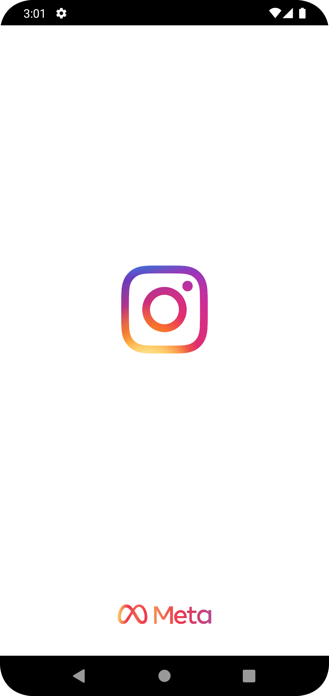
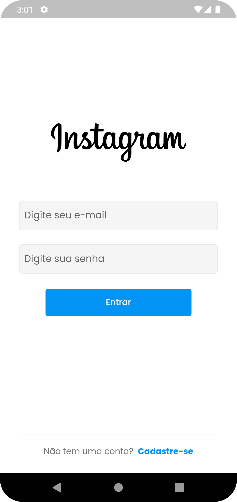
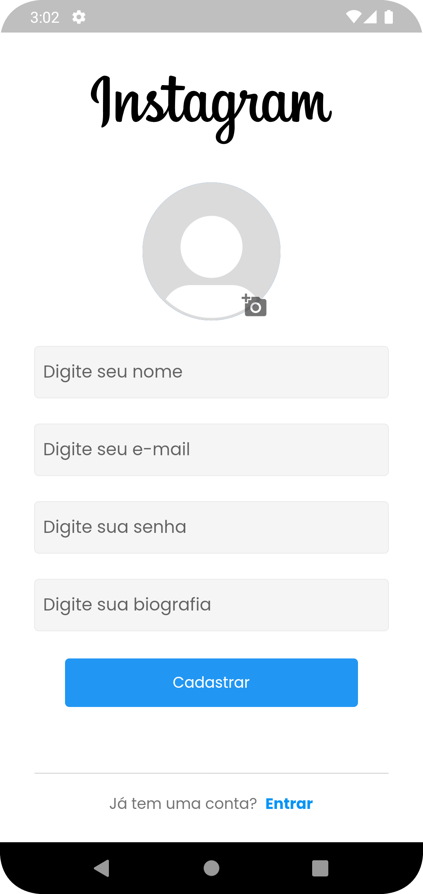
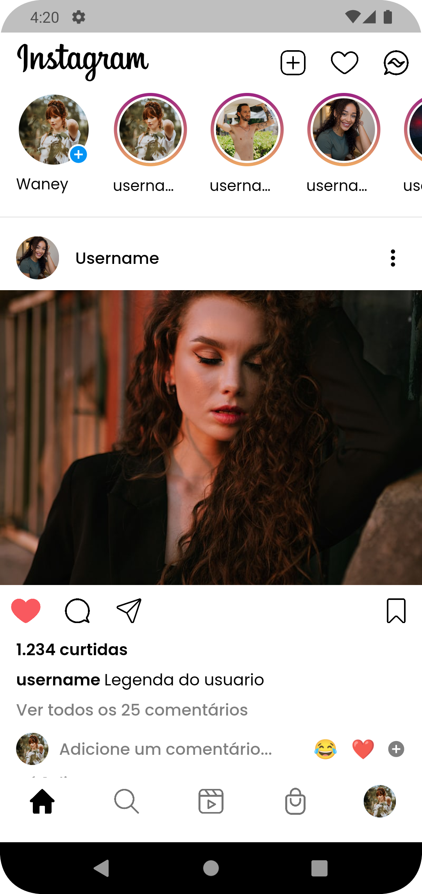
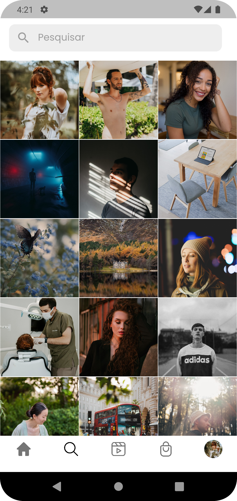
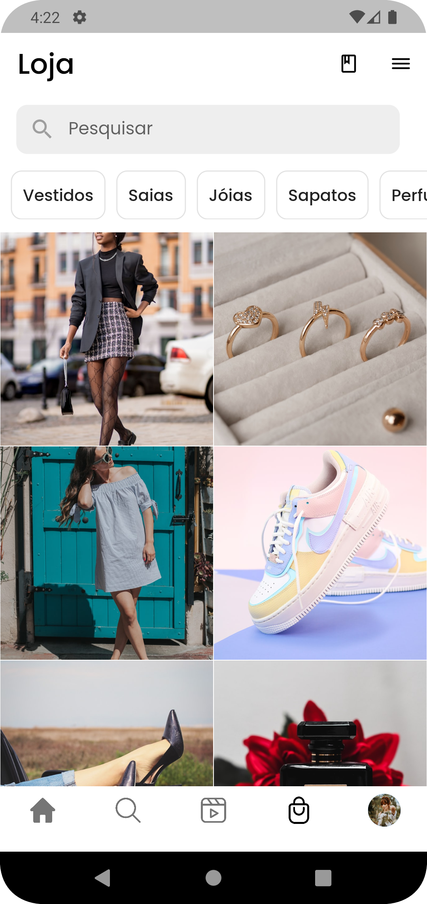
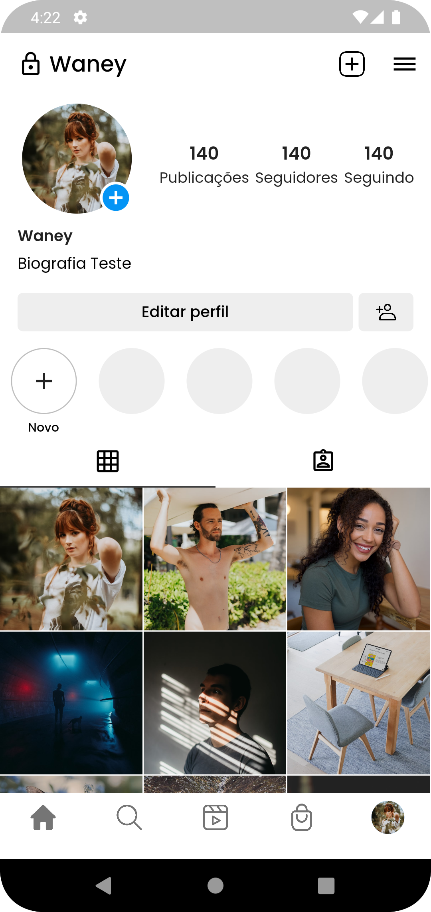

    

# 📷 Instagram Clone

Uma recriação do popular aplicativo Instagram, enfatizando a implementação das funções fundamentais de login e cadastro de usuários. Com o uso de tecnologias como Dart, Flutter, Firebase, Modular e MobX, estou em processo de construção da estrutura para incluir recursos como Feed, Explorar, Perfil, Reels e muito mais. Fique atento para acompanhar o desenvolvimento contínuo deste projeto.

## 🚀 Tecnologias Utilizadas:

**Dart**: Linguagem de programação utilizada para desenvolver aplicativos Flutter.

**Flutter**: Framework de desenvolvimento de interface de usuário multiplataforma, utilizado para criar a interface do aplicativo Instagram Clone.

**Firebase**: Plataforma de desenvolvimento de aplicativos móveis do Google, utilizada para autenticação de usuário no aplicativo.

**Modular**: Framework de injeção de dependência e roteamento, utilizado para organizar e estruturar o código do projeto.

**MobX**: Biblioteca de gerenciamento de estado reativa, utilizada para controlar o estado da aplicação e facilitar a comunicação entre os diferentes componentes.

## Contribuindo

Contribuições são bem-vindas! Se você tiver alguma sugestão de melhoria, correção de bugs ou novas funcionalidades, sinta-se à vontade para abrir uma issue ou enviar um pull request no repositório do projeto.